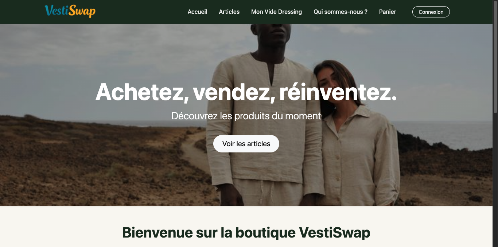
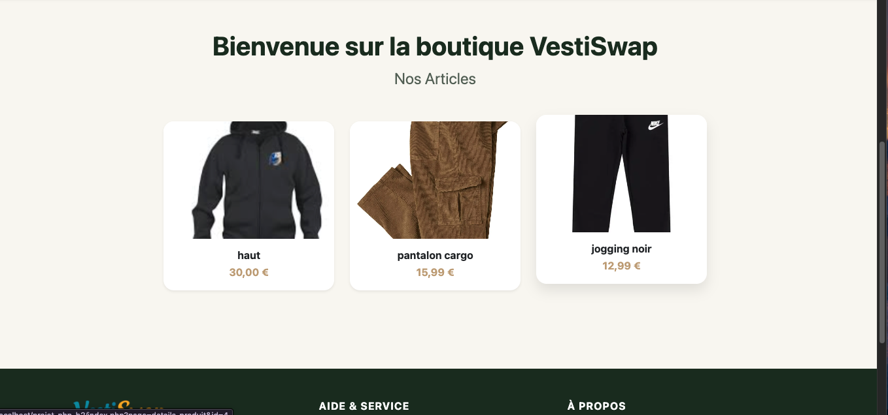
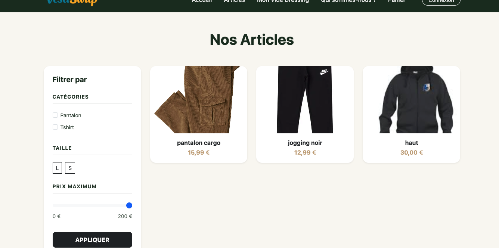
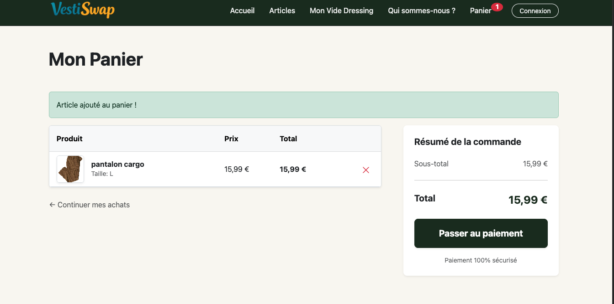

# 🛍️ Projet PHP B2 — Site e-commerce vêtements

> Projet de groupe (3 personnes) — Module PHP / Architecture MVC
> Réalisé en B2 — Formation informatique

**Langages** : PHP, HTML/CSS, MySQL

---

## 🎯 Objectif

Développer en équipe de 3 un site e-commerce permettant la vente de vêtements entre utilisateurs, avec un espace client, un espace administrateur, un panier, un système de paiement et la génération automatique de factures.

---

## 📚 Notions abordées

- Architecture MVC en PHP
- Vues PHP dynamiques (partiels, templates)
- HTML/CSS — mise en page, formulaires
- Connexion PDO à une base de données MySQL
- Gestion de sessions (connexion, panier)
- Validation de formulaires côté serveur
- Génération de factures automatique
- Collaboration en équipe avec GitHub

---

## 💡 Ce que j'ai appris

Dans ce projet, je me suis occupée de la partie **front-end** : les vues PHP, la mise en page, le CSS et toutes les interfaces utilisateur (formulaires, pages produits, panier, espace admin). J'ai aussi donné un coup de main sur d'autres tâches au fil du projet.

---

**C'est quoi l'architecture MVC ?**

Quand on développe une application web, on pourrait tout mettre dans un seul fichier : la connexion à la base de données, les calculs, et l'affichage. Ça fonctionnerait, mais très vite le code devient impossible à lire et à maintenir.

L'architecture MVC — **Modèle, Vue, Contrôleur** — résout ce problème en découpant l'application en trois parties avec des rôles bien séparés :

- **Modèle** → gère les données. C'est lui qui parle à la base de données (récupérer un article, enregistrer une commande, etc.)
- **Vue** → gère l'affichage. C'est la page HTML/PHP que l'utilisateur voit dans son navigateur. Elle ne sait pas d'où viennent les données — elle les affiche, c'est tout.
- **Contrôleur** → fait le lien. Quand un utilisateur clique sur "Ajouter au panier", c'est le contrôleur qui reçoit la demande, interroge le modèle, et envoie le résultat à la vue.

Concrètement dans ce projet : quand un utilisateur visite la page d'un article, le contrôleur reçoit la requête, demande au modèle les infos de l'article, et les transmet à la vue qui les affiche.

---

Me concentrer uniquement sur la vue m'a appris à travailler dans une architecture que je ne contrôlais pas entièrement — utiliser les données transmises par les contrôleurs sans toucher à la logique métier. Un vrai exercice de collaboration.

---

## 🗂️ Structure du projet

```
projet-php-b2/
├── src/
│   ├── config/         → connexion PDO à la base de données
│   ├── controllers/    → logique métier et routage
│   ├── models/         → représentation des entités
│   ├── Repositories/   → requêtes SQL et accès aux données
│   ├── Services/       → logique métier avancée
│   ├── Utils/          → utilitaires (logger, etc.)
│   ├── Validators/     → validation des formulaires
│   └── views/          → pages PHP dynamiques ← mon périmètre principal
├── public/             → CSS, images ← mon périmètre principal
├── sql/                → script de création de la base
├── logs/               → logs d'activité
└── index.php           → point d'entrée (routeur)
```

---

## ✨ Fonctionnalités

- Inscription et connexion utilisateur
- Mise en vente, affichage et suppression d'articles
- Panier d'achat et passage de commande
- Paiement sécurisé (simulation)
- Génération automatique d'une facture après paiement
- Espace administrateur : gestion des utilisateurs et des articles

---

## 🔗 Repos du projet

| Partie | Repo | Description |
|--------|------|-------------|
| Projet complet | [projet-php-b2](https://github.com/neotxt/projet-php-b2) | Code source complet (3 contributeurs) |

---

## ⚙️ Installation

### Prérequis
- XAMPP (Apache + MySQL)
- phpMyAdmin

### Étapes

```bash
# 1. Cloner le repo dans htdocs de XAMPP
git clone https://github.com/neotxt/projet-php-b2
# placer dans : xampp/htdocs/projet-php-b2

# 2. Importer la base dans phpMyAdmin
# → Fichier : sql/database.sql

# 3. Adapter la connexion si besoin
# → src/config/database.php

# 4. Démarrer Apache + MySQL via XAMPP

# 5. Ouvrir dans le navigateur
# → http://localhost/projet-php-b2
```

---

## 📦 Technologies

| Outil | Rôle |
|-------|------|
| PHP | Langage back-end, architecture MVC |
| MySQL | Base de données relationnelle |
| phpMyAdmin | Interface base de données |
| XAMPP | Serveur local Apache + MySQL |
| HTML/CSS | Intégration front-end |
| GitHub | Collaboration et gestion de versions |

---

## 🐛 Difficultés rencontrées

Comprendre comment les données circulent dans une architecture MVC sans en avoir fait le back-end. Au début, ce n'était pas évident de savoir quelles variables étaient disponibles dans les vues, ni comment les utiliser correctement sans casser la logique des contrôleurs.

---

## 🖼️ Captures d'écran





---

*Projet de groupe réalisé dans le cadre du module PHP B2 — Formation informatique*