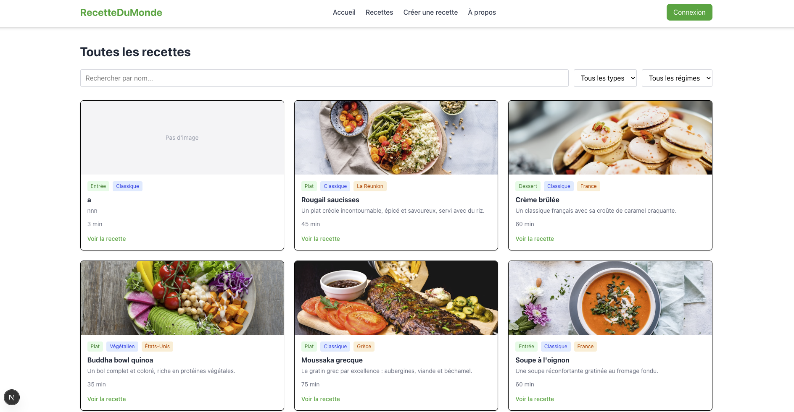
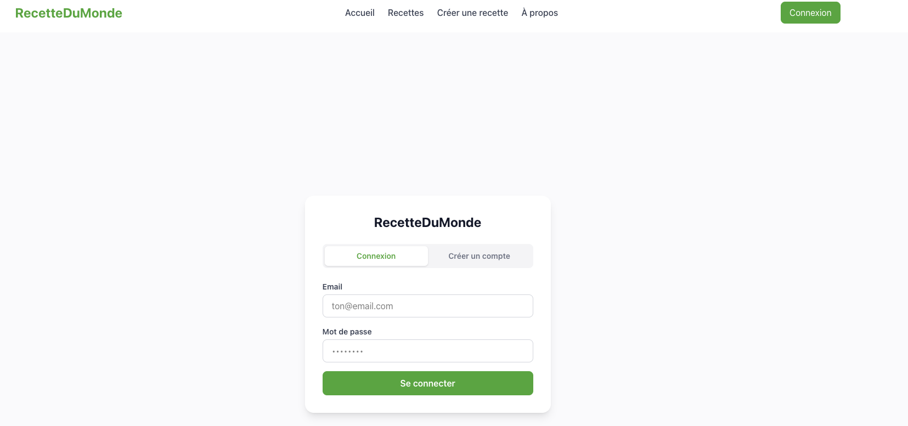
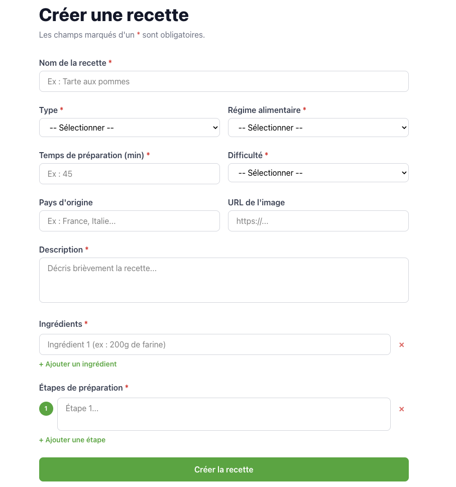
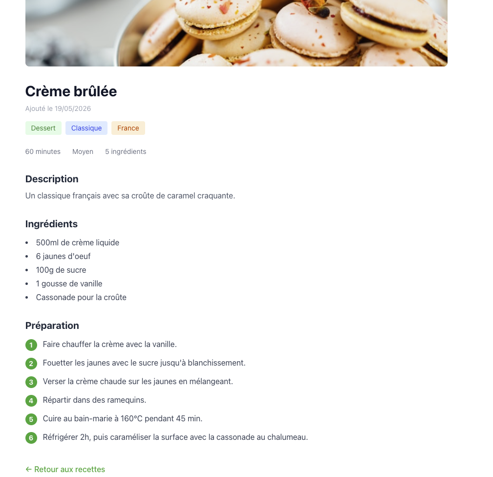

# 🍽️ RecetteDuMonde — API REST complète
> Projet individuel de fin de module — API REST avec authentification et interface
> Réalisé le 20/05/2026

**Langages** : TypeScript, Next.js, MongoDB
**Niveau** : 🟡 Moyen

---
## 🎯 Objectif
Concevoir une API REST complète pour gérer des recettes internationales,
la connecter à une base de données MongoDB, et la relier à une interface
utilisateur. Le tout sécurisé avec une authentification JWT.

---
## 📚 Notions appliquées
- Architecture Client / Serveur / Base de données
- API REST — routes, verbes HTTP, codes de statut
- CRUD complet (GET, POST, PUT, DELETE)
- Recherche et filtrage avec query params et $regex MongoDB
- Authentification JWT (JSON Web Token)
- Hashage de mot de passe avec bcryptjs
- Middleware de vérification de token
- Next.js App Router — routes API et pages front
- TypeScript
- React — useState, useEffect, fetch()
- Tailwind CSS

---
## 🔗 Repos du projet
| Partie | Repo | Description |
|--------|------|-------------|
| Full-stack | [projet_yboost](https://github.com/Loulia-06/Projet_YBOOST) | API + Front dans le même projet Next.js |

---
## 🌐 Démo en ligne
[À venir — déploiement Vercel prévu]

---
## 🐛 Difficultés rencontrées

La plus grosse difficulté c'était de comprendre la logique des routes —
pourquoi on structure les URLs d'une certaine façon et pourquoi on utilise
tel verbe HTTP plutôt qu'un autre. Au début pour moi tout aurait pu être
un GET.

Le flux JWT dans sa globalité était aussi complexe à relier — comprendre
que le mot de passe ne transite qu'une seule fois à la connexion, et
qu'ensuite c'est le token qui prend le relais dans chaque requête.

Comprendre aussi pourquoi le front ne parle jamais directement à MongoDB
mais toujours via l'API — la séparation en trois couches n'était pas
évidente au départ.

---
## 🖼️ Captures d'écran

## 🎥 Démo vidéo
<!-- Optionnel — colle ton lien YouTube non-listé ici : https://youtube.com/watch?v=XXXXX -->

---
*Projet réalisé dans le cadre du parcours de formation dev*